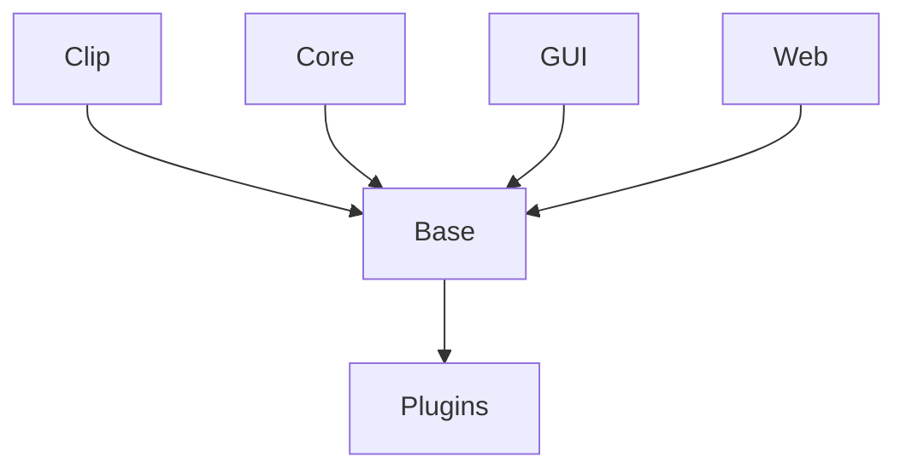

# Swish

Swish is an awesome offline data transformation tool, which was originally influenced by the Mac tool [Boop](https://boop.okat.best).

Developers often get data in weird, unreadable formats. Often it's tempting to find a random online tool to transform the data into something you can use; this is dangerous though because you don't know what these services will do with your private data. You're also limited to what transformations are provided.

Instead - Just Swish It!

Swish is built with Node, Electron, and Angular.

## Repo

The Swish repo contains the following:

### Apps

* [**Clip**](Clip)  
  A lightweight GUI for Swish. This sits in your OS tray and provides a spotlight-style UI to search for and select a plugin, using your clipboard.
* [**Core**](Core)  
  The most basic Swish experience. Run in your terminal, pipe the data from any app through Swish to transform it before you use it.
* [**Gui**](Gui)  
  The full-featured GUI for Swish.
* [**Web**](Web)  
  A hosted web interface for Swish. Host it somewhere you trust and you can Swish without even installing it!

### Backend

* [**Base**](Base)  
  The base of all the applications. Handles configuration, loading, running and managing everything related to plugins.
* [**Plugins**](Plugins)  
  Default plugins which come with all the Swish apps, and models for the structure of how plugins behave.

### Other

* [**Plugin-Examples**](Plugin-Examples)  
  Some example plugins to get started building your own. Shows some useful concepts as well (e.g. running other plugins and recursion)
* [**docs**](docs)  
  Documentation

### Dependencies

This repo has a strict dependency structure:

